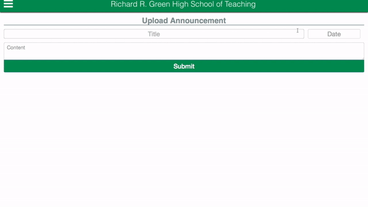

## Richard R. Green High School of Teaching Website

## Purpose of this Project
This project part of a personal challenge to redesign my school website completly as it needed to be updated.

## Preview (Main Page, Announcements Page, Calendar Page)

## Preview (Staff Page)

## Features
 * Main:
    * Students can view the announcements and events on the main page or the pages dedicated for the announcements
    * Students can also view events on the main page or the page dedicated for events
 * Staff:
    * This project allows teachers to upload announcements and events to a database in this case Firebase
    * Prevents empty data from being uploaded to the database to avoid mistakes (Looks out for empty titles, content, date)
